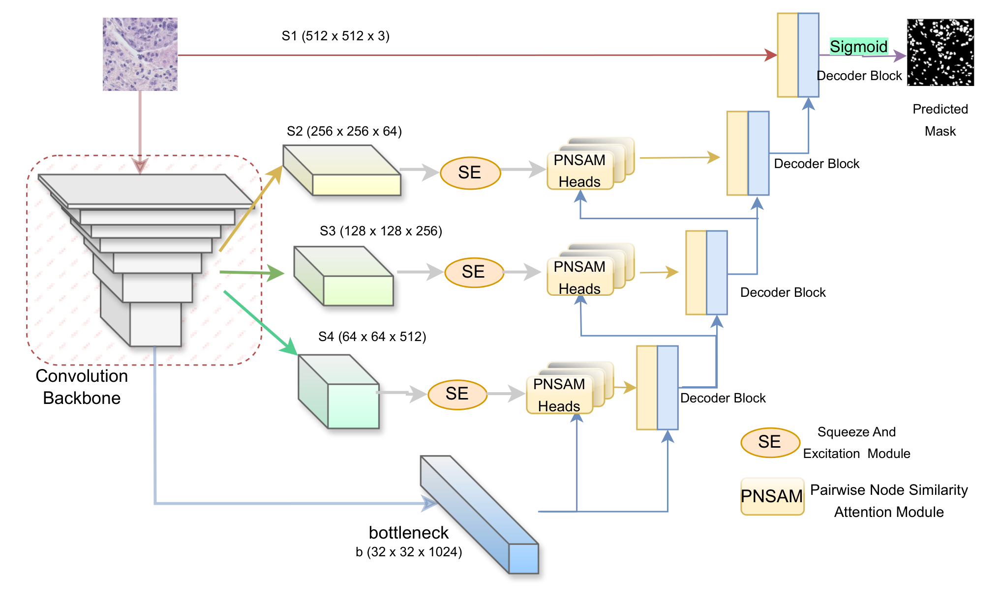

# Multi-Headed Graph-based Attention-aided U-Net for Nuclei Segmentation

This research has been accepted at the ***International Conference on Neural Information Processing (ICONIP), 2024***

## Abstract
Accurate segmentation of nuclei in histopathology images is critical for understanding tissue morphology and aiding in disease diagnosis, particularly cancer. However, this task is challenging due to the high variability in staining and diverse morphological features. In this study, we propose a novel approach that integrates a graph-based attention mechanism into the U-Net architecture. Our method utilizes astate-of-the-art encoder backbone and introduces a Pairwise Node Similarity Attention Module (PNSAM), which computes the similarity between feature channels using a kernel function that inherently applies a dot product to capture spatial information. This module enhances the relationships between local and non-local feature vectors within a feature map obtained from multiple encoder layers, forming a graph attention map. Additionally, we incorporate a channel pruning mechanism that leverages predefined statistical knowledge to select important individual channels for graph attention map creation. The resulting graph attention map enhances encoder features for skip connections. Furthermore, we combine activated features from multiple trainable PNSAM heads to generate a more diverse and robust feature map. We evaluated our novel architecture on three widely recognized datasets: Monuseg, TNBC, and CryoNuSeg. 




## Project Structure

This project is organized into several modules to enhance readability and maintainability. Each module corresponds to a specific aspect of the project, such as data processing, model architecture, custom layers, loss functions, metrics, and training scripts. Below is an overview of each module and its purpose:

### 1. `data_utils.py`

- **Purpose**: Handles data loading and preprocessing.
- **Description**: Contains functions to create training and testing datasets by loading images and masks from specified directories. It includes data augmentation and normalization steps essential for preparing the data for model training.

### 2. `layers.py`

- **Purpose**: Defines custom neural network layers and components.
- **Description**: Implements the custom layers used in the model architecture, including:

  - **SqueezeExcitation**: Enhances feature representations by modeling interdependencies between channels.
  - **WeightLayer**: Applies learnable weights to feature maps.
  - **NewGraphLayer**: Constructs graph attention maps by computing similarities between feature vectors.
  - **GraphAttentionLayer**: Integrates the graph attention mechanism into the model, enhancing feature maps using the computed attention maps.
  - **GroupNormalization**: Normalizes inputs across groups of channels, improving training stability.
  - **CombinedUpsampleLayer**: Upsamples feature maps using a combination of methods to preserve spatial information.

### 3. `model.py`

- **Purpose**: Constructs the main model architecture.
- **Description**: Defines the neural network model that integrates the graph-based attention mechanism into a U-Net architecture with a encoder backbone (e.g., DenseNet121). It includes the encoder, decoder, attention modules, and skip connections enhanced with graph attention maps.

### 4. `losses.py`

- **Purpose**: Implements custom loss functions for training.
- **Description**: Contains loss functions tailored to the segmentation task, including:

  - **DiceCoeff**: Computes the Dice Coefficient, a measure of overlap between predicted and ground truth masks.
  - **DiceLoss**: Calculates the Dice Loss, encouraging the model to maximize overlap with the ground truth.
  - **HybridLoss**: Combines focal Tversky loss and Dice loss to address class imbalance and improve segmentation performance.
  - **HausdorffLoss**: Measures the Hausdorff distance between predicted and ground truth masks to capture boundary discrepancies.

### 5. `metrics.py`

- **Purpose**: Defines custom evaluation metrics.
- **Description**: Implements metrics to assess the model's performance during training and validation, including:

  - **DiceCoeff**: Same as in `losses.py`, used here for evaluation.
  - **Precision**: Measures the proportion of true positives among all positive predictions.
  - **Recall**: Calculates the proportion of true positives among all actual positives.
  - **F1Score**: Combines precision and recall to provide a single performance metric.

### 6. `train.py`

- **Purpose**: Main script to run the training process.
- **Description**: Orchestrates the training workflow by:

  - Loading and preprocessing the data using functions from `data_utils.py`.
  - Initializing the model from `model.py`.
  - Compiling the model with custom losses and metrics defined in `losses.py` and `metrics.py`.
  - Running the training loop, including training and validation phases.
  - Saving the best-performing model based on validation metrics.

## How to Run

To train the model and reproduce the results, follow these steps:

1. **Clone the Repository**: Download or clone the project repository to your local machine.

2. **Install Dependencies**:

   - Ensure you have Python 3.6 or higher.
   - Install the required packages using `pip`. You can create a virtual environment to manage dependencies.
   - Required packages include TensorFlow, Keras, NumPy and keras-unet-collection.

3. **Prepare the Data**:

   - Download the datasets (Monuseg, TNBC, CryoNuSeg) and organize them into training and testing directories.
   - Update the paths in `train.py` to point to your local data directories:

     ```python
     train_path = '/path/to/train'
     test_path = '/path/to/test'
     ```

4. **Run the Training Script**:

   - Execute the `train.py` script to start training:

     ```bash
     python train.py
     ```

   - The script will begin training the model, displaying training and validation metrics for each epoch.

5. **Monitor Training**:

   - Training progress, including loss and metrics, will be output to the console.
   - The best-performing model based on validation Dice Coefficient will be saved automatically.

6. **Evaluate the Model**:

   - After training, you can use the saved model to perform inference on test images or evaluate it further using custom scripts.

## Dependencies

- **Python 3.6+**
- **TensorFlow 2.x**
- **Keras**
- **NumPy**
- **keras-unet-collection**: For advanced loss functions.

## Dataset Preparation

Ensure that the datasets are prepared according to the expected directory structure:

## Citation

If you use this code or find this work helpful, please consider citing:


